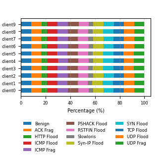
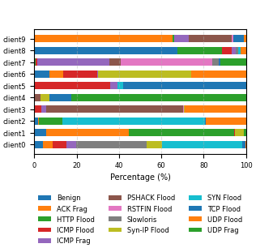

## 1. General Information

- **Title:** DDoS Attack Detection at IoT Gateways Using Federated Learning on Resource-Constrained Devices  
- **Authors:** Le Ngoc Lanh, Chu Ba Thanh  
- **Affiliation:** Faculty of Information Technology, Hungyen University of Technology and Education  
- **Corresponding Author:** Chu Ba Thanh  
- **Contact Email:** thanhcb.dce@gmail.com  

- **Research Domain:** IoT security, distributed intrusion detection, federated learning on edge devices  

- **Research Context:**  
  The rapid expansion of IoT systems has significantly increased the attack surface of modern networks. IoT gateways, which aggregate traffic from multiple devices, are critical points for detecting distributed denial-of-service (DDoS) attacks. However, these gateways typically operate under strict resource constraints, making conventional centralized intrusion detection approaches inefficient and privacy-invasive.

- **Research Objective:**  
  To design and evaluate a lightweight federated learning (FL) framework for DDoS detection at IoT gateways, focusing on detection performance, robustness under non-IID data, and deployment feasibility on resource-constrained edge devices.

- **Dataset:** CICIoT2023  

- **Experimental Platform:**  
  A cluster of 10 Raspberry Pi 4 devices acting as IoT gateways  

- **Evaluated Models:**  
  - LRNet-Lite  
  - MLPNet-Lite  
  - TabResNet-Lite  

- **Aggregation Methods:**  
  - FedAvg  
  - FedProx  

- **Data Distribution Settings:**  
  - IID  
  - non-IID (Dirichlet-based partitioning)  

- **Evaluation Metrics:**  
  - Macro F1-score  
  - Local training time  
  - Round time  
  - CPU usage  
  - RAM usage  
  - Model size  
  - Communication cost  
  - Inference latency  
  - Throughput  

- **Keywords:**  
  IoT security, DDoS detection, federated learning, edge computing, Raspberry Pi 4

## 2. Short Summary

This paper addresses the problem of detecting distributed denial-of-service (DDoS) attacks at IoT gateways, where devices operate under strict resource constraints and centralized data collection raises privacy and communication concerns. To overcome these limitations, the authors propose a lightweight federated learning (FL) framework that enables multiple gateways to collaboratively train intrusion detection models without sharing raw traffic data. The framework is evaluated using the CICIoT2023 dataset on a cluster of ten Raspberry Pi 4 devices, employing three lightweight models (LRNet-Lite, MLPNet-Lite, and TabResNet-Lite) under both IID and non-IID data distributions with FedAvg and FedProx aggregation. Experimental results show that FL achieves F1-scores of approximately 91–92% under IID settings and 88–89% under non-IID settings, while maintaining low inference latency (below 5 ms per sample) on edge devices. These findings demonstrate that federated learning is a practical, privacy-preserving, and efficient solution for distributed DDoS detection in real-world IoT environments.

## 3. Contributions

- This paper proposes a lightweight federated learning framework for gateway-level DDoS detection in IoT environments, specifically designed for deployment on resource-constrained edge devices.

- It evaluates three lightweight models—**LRNet-Lite**, **MLPNet-Lite**, and **TabResNet-Lite**—to compare their detection capability and deployment cost under federated learning settings.

- It investigates the impact of both **IID** and **non-IID** data distributions, showing how data heterogeneity affects model convergence and global detection performance.

- It compares two federated aggregation strategies, **FedAvg** and **FedProx**, to analyze their robustness under heterogeneous client data and partial client participation.

- It studies different client participation rates (**30%**, **50%**, **70%**, and **100%**) in the non-IID setting to assess how partial participation influences convergence behavior and final F1-score.

- It validates the practical feasibility of the proposed framework on a real cluster of **10 Raspberry Pi 4 devices**, rather than relying only on simulation-based evaluation.

- It provides a joint analysis of both **detection performance** and **deployment-oriented metrics**, including CPU usage, RAM usage, local training time, round time, model size, communication cost, inference latency, throughput, and device temperature.

- It demonstrates that federated learning can achieve near-centralized performance under IID conditions and remain effective under non-IID conditions, while preserving data locality and maintaining acceptable edge inference latency.

## 4. Main Results

### 4.1. Centralized vs. Federated Performance under IID Data

Table 1 shows that federated learning achieves performance very close to centralized training under the IID setting. Across all three lightweight models, the difference between centralized learning and federated learning remains below 1 percentage point in macro F1-score. This suggests that when client data are similarly distributed, the federated aggregation process can preserve most of the discriminative power of centralized learning while eliminating the need to share raw traffic data.

**Table 1. F1-score of centralized and federated learning under IID data**

| Model | Setting | Clients | F1-Score |
|---|---|---:|---:|
| LRNet-Lite | Federated | 10 | 91.10 |
| LRNet-Lite | Centralized | - | 92.05 |
| MLPNet-Lite | Federated | 10 | 91.87 |
| MLPNet-Lite | Centralized | - | 92.58 |
| TabResNet-Lite | Federated | 10 | 91.93 |
| TabResNet-Lite | Centralized | - | 92.79 |

**Key observations:**
- **TabResNet-Lite** achieves the highest F1-score in both centralized and federated settings.
- **MLPNet-Lite** performs slightly below TabResNet-Lite but still maintains strong detection capability.
- **LRNet-Lite** has the lowest F1-score among the three models, but remains competitive given its much lower model complexity.
- Overall, federated learning recovers most of the accuracy of centralized learning under IID data.

### 4.2. Impact of Non-IID Data Distribution and Client Participation

The proposed framework is further evaluated under non-IID data conditions, where client datasets are heterogeneous and better reflect real-world IoT environments. In this setting, the client participation rate is varied at **30%**, **50%**, **70%**, and **100%** to analyze its effect on convergence and global model performance.

From the results, higher client participation rates generally lead to smoother and faster convergence, as the server aggregates updates from a more representative subset of clients in each communication round. At lower participation rates (e.g., **30%**), the loss curves fluctuate more strongly due to increased variance from heterogeneous client updates.

In addition, **FedProx** demonstrates more stable convergence than **FedAvg** under non-IID conditions, particularly for more complex models such as MLPNet-Lite and TabResNet-Lite.

---

#### Table 2. Global F1-Score under non-IID data and different client participation rates

| Model | Method | 30% clients | 50% clients | 70% clients | 100% clients |
|---|---|---:|---:|---:|---:|
| LRNet-Lite | FedAvg | 87.58 | 87.51 | 87.90 | 87.78 |
| LRNet-Lite | FedProx (μ = 0.1) | 88.39 | 88.36 | 88.24 | 87.78 |
| MLPNet-Lite | FedAvg | 88.68 | 88.92 | 89.24 | 89.15 |
| MLPNet-Lite | FedProx (μ = 0.1) | 88.73 | 88.98 | 89.10 | 88.84 |
| TabResNet-Lite | FedAvg | 88.26 | 88.98 | 89.39 | 89.11 |
| TabResNet-Lite | FedProx (μ = 0.1) | 89.13 | 89.15 | 89.00 | 88.91 |

**Key observations:**
- Non-IID data introduces a consistent but moderate drop in performance compared to the IID setting.
- All models still maintain strong performance, with F1-scores in the range of **87.5–89.4**.
- **FedProx** often outperforms **FedAvg** at lower participation rates, indicating better robustness to data heterogeneity.
- Increasing client participation generally improves stability and tends to benefit more complex models.

### 4.3. Edge Deployment Feasibility and Model Trade-off

In addition to detection performance, the paper evaluates deployment-oriented metrics on real edge devices (Raspberry Pi 4). These results are essential for assessing whether the proposed federated learning framework can operate effectively under resource constraints typical of IoT gateways.

---

#### Table 3. On-device resource usage during federated training on Raspberry Pi 4

| Model | % CPU (mean / max) | % RAM (mean / max) | Temp (°C) (mean / max) | Local Train Time (s) (mean / max) | Round Time (s) | Params | Model Size (KiB) | Communication (KiB) |
|---|---|---|---|---|---:|---:|---:|---:|
| LRNet-Lite | 28.11 / 37.55 | 22.87 / 28.9 | 39.74 / 48.69 | 26.7 / 30.1 | 2335 | 520 | 3.82 | 20.48 |
| MLPNet-Lite | 40.48 / 54.3 | 22.17 / 28.8 | 41.47 / 53.07 | 35.7 / 42.1 | 2828 | 16333 | 68.08 | 634.88 |
| TabResNet-Lite | 52.76 / 62.9 | 21.60 / 28.7 | 43.31 / 56.48 | 59.9 / 72.2 | 4094 | 107917 | 431.36 | 4218.88 |

**Key observations (training phase):**
- **LRNet-Lite** has the lowest computational cost, smallest model size, and minimal communication overhead.
- **MLPNet-Lite** provides a moderate balance between resource consumption and model complexity.
- **TabResNet-Lite** incurs the highest CPU usage, longest training time, and largest communication cost.
- Model complexity significantly impacts training cost, which is critical in resource-constrained environments.

---

#### Table 4. Real-time inference latency and throughput on Raspberry Pi 4

| Model | Latency ms/sample (P50 / P95) | Throughput (samples/s ± std) | % CPU (mean ± std) | % RAM (mean ± std) | Temp (°C) (mean ± std) |
|---|---|---:|---:|---:|---:|
| LRNet-Lite | 0.166 ± 0.001 / 0.2 ± 0.001 | 1682.98 ± 5.77 | 5.43 ± 0.04 | 22.06 ± 0.14 | 37.47 ± 0.566 |
| MLPNet-Lite | 2.391 ± 0.011 / 3.057 ± 0.004 | 296.74 ± 4.97 | 43.62 ± 1.16 | 22.31 ± 0.18 | 42.94 ± 1.721 |
| TabResNet-Lite | 4.922 ± 0.004 / 5.043 ± 0.034 | 174.89 ± 0.24 | 54.86 ± 0.28 | 22.34 ± 0.14 | 44.89 ± 2.156 |

**Key observations (inference phase):**
- **LRNet-Lite** achieves the lowest latency and highest throughput, making it ideal for real-time applications.
- **MLPNet-Lite** offers a balanced trade-off between accuracy and computational cost.
- **TabResNet-Lite** provides the best detection performance but at the cost of higher latency and resource usage.
- All models remain deployable on Raspberry Pi 4, confirming the feasibility of edge-based federated intrusion detection.

---

#### Overall Trade-off Analysis

- There is a clear trade-off between **model accuracy** and **deployment cost**:
  - **LRNet-Lite:** most efficient, lowest cost, suitable for strict real-time constraints  
  - **MLPNet-Lite:** balanced performance and cost  
  - **TabResNet-Lite:** highest accuracy, highest resource consumption  

- The results demonstrate that federated learning can be practically deployed on low-cost IoT gateways, with model selection depending on application requirements (latency vs. accuracy).

## 5. Conclusion

This paper investigates a lightweight federated learning framework for DDoS detection at IoT gateways operating under resource constraints. Using the CICIoT2023 dataset and a cluster of ten Raspberry Pi 4 devices, the study evaluates three lightweight models under both IID and non-IID settings while also measuring practical training and inference costs on real edge hardware.

The results show that federated learning can approach centralized learning performance under IID data and remain effective under heterogeneous non-IID conditions. In particular, the framework achieves macro F1-scores of approximately **91–92%** in IID settings and **88–89%** in non-IID settings, while maintaining inference latency below **5 ms per sample** on Raspberry Pi 4 devices.

The findings also highlight an important trade-off between accuracy and deployment cost. **LRNet-Lite** is the most efficient model for real-time deployment, **MLPNet-Lite** provides a balanced compromise between performance and resource usage, and **TabResNet-Lite** achieves the strongest detection performance at the highest computational cost. In heterogeneous settings, **FedProx** further improves training stability compared with FedAvg.

Overall, the paper demonstrates that federated learning is a feasible, privacy-preserving, and practically deployable solution for distributed DDoS detection at IoT gateways, especially in environments where data locality, limited resources, and edge inference efficiency are critical.